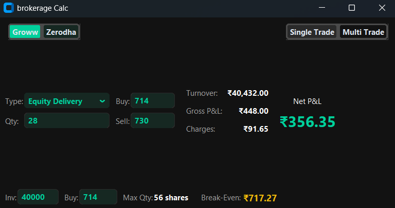
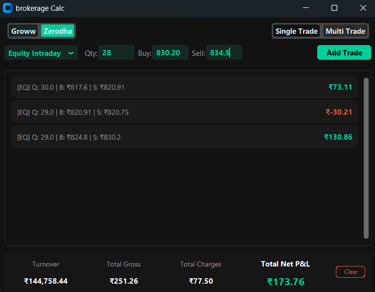

# 📈 Brokerage & Net P&L Calculator

A lightweight, portable desktop application for Windows and macOS designed to accurately calculate Net Profit & Loss, comprehensive brokerage charges, and break-even points for your stock market trades.

Currently supports **Groww** and **Zerodha** fee structures.

---

## ✨ Features

- **No Installation Required:** Completely portable standalone files for Windows (`.exe`) and macOS. Just download and run.
- **Dual Broker Support:** Toggle instantly between Groww and Zerodha charge structures.
- **Single Trade Mode:**
  - Calculate turnover, gross P&L, total charges (Brokerage, STT, Exchange Fees, GST, SEBI, Stamp Duty), and Net P&L.
  - Instant Break-Even price calculation.
  - Maximum quantity calculator based on your available investment capital.
- **Multi-Trade Mode:**
  - Add multiple trades (mix of Delivery and Intraday) to a running ledger.
  - View total aggregated turnover, gross P&L, total charges, and Net P&L for the day.
- **Modern UI:** Built with a sleek, distraction-free dark mode interface.

---

## 🚀 How to Download and Run

Since this is a standalone executable, you do not need Python or any other dependencies installed on your system.

1. **Download:** Grab the version for your operating system:
   - **Windows:** [Download Brokerage.exe](https://github.com/kumar-yogesh08/Brokerage/releases/latest/download/Brokerage.exe)
   - **macOS:** [Download Brokerage](https://github.com/kumar-yogesh08/Brokerage/releases/latest/download/Brokerage)

   Or browse all versions on the **[Releases](https://github.com/kumar-yogesh08/Brokerage/releases)** page.

2. **Run:**
   - **Windows:** Double-click the `.exe` to open the calculator.
   - **macOS:** Double-click the downloaded file. _(Note: If macOS says the file is not executable, open your Terminal, type `chmod +x `, drag and drop the file into the terminal, and hit Enter)._
3. **Optional:** You can move this file to your Desktop or pin it to your Taskbar/Dock for quick access during trading hours.

### ⚠️ A Note on Windows SmartScreen

Because this application is packaged as an independent executable without an expensive corporate publisher certificate, **Windows Defender SmartScreen** may flag it as an "unrecognized app" the first time you open it.

- To run it, simply click **"More info"** and then **"Run anyway"**.

### ⚠️ A Note on macOS Gatekeeper

Similarly, because the macOS version is not signed with an Apple Developer certificate, macOS Gatekeeper will likely block it the first time with a message saying _"Brokerage cannot be opened because the developer cannot be verified."_

- To run it, simply **Right-Click** (or Control-click) the file in Finder, select **Open**, and then click **Open** again in the warning dialog. You only need to do this the first time.

---

## 📸 Screenshots

### Single Trade Mode

Get an instant, detailed breakdown of a single transaction. This view provides your Gross P&L, Total Charges, and exact Net P&L. It also features a capital allocation tool to determine the maximum shares you can buy based on your investment amount, alongside an automatic Break-Even price calculator.

### Multi-Trade Mode

Perfect for active trading sessions. Add multiple Equity Delivery or Intraday trades to your ledger to calculate your total aggregated Turnover, Gross P&L, combined Charges, and final Net P&L across all positions for the day.

---

## ⚖️ Disclaimer

This tool is for educational and informational purposes only. While the mathematical formulas are strictly mapped to the publicly available fee structures of the supported brokers, actual platform charges may occasionally vary due to micro-rounding differences or sudden regulatory changes. Always verify final charges on your broker's official contract note.
